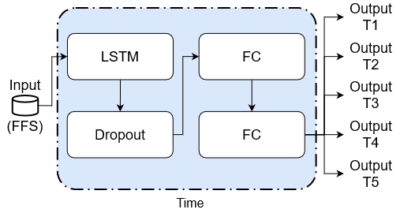
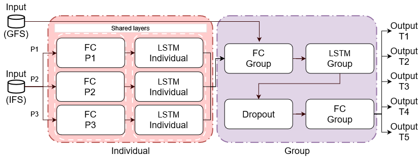
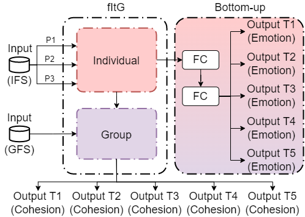
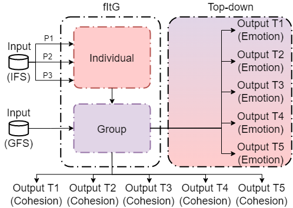
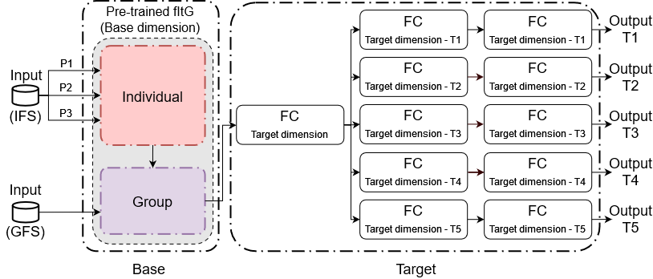

# The GRACE_Project

GRACE (Groups’ Analysis for automated Cohesion Estimation) is a fundamental research project funded by the French National Research Agency (ANR) within the frame of its  JCJC program (GRACE, project ANR-18-CE33-0003-01). It contributes to the axis 3 “Interaction, Robotique – Intelligence Artificielle” of the challenge 7 “Société de l’information et de la communication”. Activities in GRACE were carried out at LTCI, Télécom Paris, Institut polytechnique de Paris.

The project aims at developing computational models of cohesion among humans able to integrate the task and social dimensions of cohesion and also accounting for their relationship and their development over time. 

This repository contains the models described in currently published papers. 

## Computational models of cohesion

All the computational models of cohesion developed under the GRACE project are located in the "models" folder.
They can be found through their acronyms.

It includes the following with their preferred citation (see the end of the file for the details):
- the "_Full Interaction-LSTM_" (FI-LSTM) - preferred citation: @ICMI2021
- the "_from Individual to Group_" (fItG) - preferred citation: @ACII2021
- the fItG integrating emotion (fItG_emotion) - preferred citation: @ACII2021
- the "_Transfer Between Dimensions_" (TBD) - preferred citation: @ICMI2021

## How to use the models?
Python 3.7, Tensorflow 2.6 and all its dependencies should first be installed.

All the architectures could be obtained by calling its function that will return the desired model instance.
Please note that, at this point, the model still needs to be compiled.

The first variables declared in the functions are, in this repository, hard-coded to match the parameters used in our papers.
Depending on your requirements (e.g., inputs, training procedure), you might need to add these parameters as arguments of the function to dynamically set them.

## Description of the models

### The Full Interaction-LSTM (FI-LSTM)

This DNN architecture integrates the time by inputting 91 features to an LSTM layer with 30 units This layer is followed by a Dropout layer with a dropout rate of 0.2 and by two fully connected (FC) layers with 16 and 8 units, respectively, and a ReLu activation function. 
FI-LSTM predicts the dynamics of Social and/or Task cohesion for each of the five tasks of an interaction thanks to a final FC layer with a Sigmoid activation function and one unit if the model predicts only 1 dimension or two units if the model predicts both dimensions, in a multilabel setting, and for each task.

It has 27362 trainable weights in a multilabel setting and 27357 when it predicts a single dimension only.

### The from Individual to Group (fItG)

This DNN is composed of two modules:
- The Individual module: It takes as input, all the features computed from the individuals. It is made of three branches, each one composed of a shared FC layer with a ReLu activation function and 50 units, followed by a shared LSTM layer with 50 units. 
- The Group module: It takes as input, the concatenation of the three outputs of the shared individual LSTM layers from the Individual module with the features computed from the group as a whole.
The module is made of a first FC layer with a ReLu activation function and 64 units, followed by an LSTM layer with 32 units. Next, a Dropout layer with a rate of 0.2 is used to prevent the model from overfitting. This is followed by another FC layer with a ReLu activation function and 16 units

Finally, the output consists of an FC layer with a Sigmoid activation function and one or two unit(s) depending on the number of dimensions predicted by the model (i.e. one unit for each cohesion’s dimension predicted), for each task. 

FItG has 48152 trainable weights in a multilabel setting, and 48147 when predicting only one dimension.

### fItG_emotion

We designed two architectures, starting from the fItG that both implement the Bottom-up and Top-down approaches for characterising group emotion: 
- fItG_Bu:

-fItG_Td:

In these architectures group emotion was here adressed as its valence and was integrated using multitask learning.
We expect that the prediction of the dynamics of these cohesion dimensions (taken as the primary task during the training) will be improved by the knowledge extracted from the prediction of group emotion (taken as the secondary task).

In the fItG_Bu, the three combined outputs from the Individual module are taken as input for the Bottom-up module. This input feeds two FC layers with a ReLu activation function and 64 and 16 units, respectively. These layers are followed by an FC layer with a Sigmoid activation function and one unit, for each task. These final layers predict the valence of group emotion for each task.

In the fItG_Td, the output of the Group module is taken as input. An FC layer with a Sigmoid activation function and one unit for each of the five tasks is used.

### The Transfer Between Dimensions (TBD)

TBD was conceived to reflect the contradictory views on which of the Social and Task dimensions of cohesion emerges first and affects the other one.
From this architecture, we implemented TBD-T and TBD-S. Both TBDs use a transfer learning approach to take advantage of the behavior representation learned beforehand by a pre-trained model (here the fItG) for a specific dimension to predict the other one. More specifically, TBD-S predicts the dynamics of Social cohesion using a pre-trained fItG for Task cohesion, whereas TBD-T predicts the dynamics of Task cohesion using a pre-trained fItG for Social cohesion.

They are composed of two modules:
- The Base module: Leveraging a transfer learning approach, this module learns a representation of the group behavior for a dimension (i.e., Social for TBD-T and Task for TBD-S) from which a group behavior representation for the targeted dimension (i.e., the predicted dimension) will be learned. The Base module takes as input both individual and group features (as in fItG) and it outputs the representation of the group behavior learned for the specific dimension from the last layer of the Group module of the fItG model.
- The Target module: It learns the group behavior representation of the targeted dimension (i.e., Social or Task cohesion). It consists of an FC layer with a ReLu activation function and 16 units that takes the output of the Base module as input. This FC layer is followed by five branches (one for each task). Each branch is composed of two consecutive FC layers with a ReLu activation function and eight and four units, respectively.

Finally, TBD is designed to predict only one dimension (i.e., the target dimension). Thus, the output consists of the prediction of the cohesion dynamics for the Social dimension (in the case of TBD-S) or the Task dimension (in the case of TBD-T), across the five tasks. It is composed of five branches (one for each task). Each branch consists of an FC layer with a Sigmoid activation function and one unit, predicting the dynamics of one dimension for a specific task.

Both TBD-S and TBD-T have a total of 49139 trainable weights 

## References

### @GAME-ON

GAME-ON: A Multimodal Dataset for Cohesion and Group Analysis.
Maman, L., Ceccaldi, E., Lehmann-Willenbrock, N., Likforman-Sulem, L., Chetouani, M., Volpe, G. and Varni, G.
IEEE Access, 8: 124185-124203. 2020.

### @ACII2021

Using Valence Emotion to Predict Group Cohesion’s Dynamics: Top-down and Bottom-up Approaches. 
Maman, L., Chetouani, M., Likforman-Sulem, L., and Varni, G. 
In Proceedings of the 9th International Conference on Affective Computing and Intelligent Interaction (ACII), pages 1-8, IEEE. 2021.

### @ICMI2021

Exploiting the Interplay between Social and Task Dimensions of Cohesion to Predict its Dynamics Leveraging Social Sciences. 
Maman, L., Likforman-Sulem, L., Chetouani, M., and Varni, G. 
In Proceedings of the 23rd International Conference on Multimodal Interaction (ICMI 2021), pages 16-24, ACM. 2021.

## Contributions

* Lucien Maman and Giovanna Varni designed the research framework for developing the FI-LSTM, fItG, fItG_emotions, and TBD models, and Lucien Maman implemented these models during his Thesis at LTCI, Télécom Paris under the supervision of Laurence Likforman-Sulem and Giovanna Varni from LTCI, Télécom Paris and Mohamed Chetouani from ISIR, Sorbonne University.

## Contacts

* Lucien Maman, LTCI, Télécom Paris.
* Giovanna Varni, LTCI, Télécom Paris.
